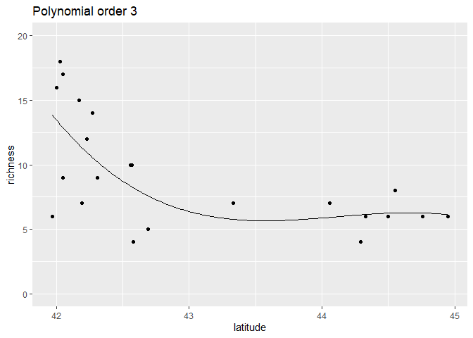
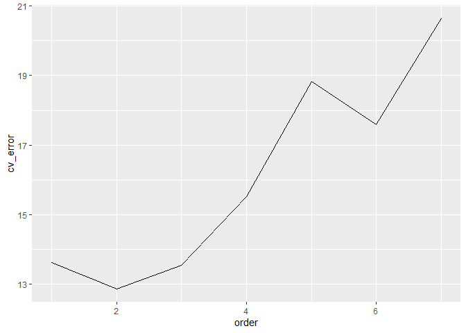

Ant data: Machine learning with polynomial model algorithm
================
Brett Melbourne
2 Dec 2022

Machine learning illustrated with the ants data and a polynomial model
algorithm.

``` r
library(ggplot2)
library(dplyr)
```

Ant data:

``` r
ants <- read.csv("data/ants.csv")
head(ants)
```

    ##   site habitat latitude elevation richness
    ## 1  TPB  forest    41.97       389        6
    ## 2  HBC  forest    42.00         8       16
    ## 3  CKB  forest    42.03       152       18
    ## 4  SKP  forest    42.05         1       17
    ## 5   CB  forest    42.05       210        9
    ## 6   RP  forest    42.17        78       15

Forest ant data:

``` r
forest_ants <- ants %>% 
    filter(habitat=="forest")
```

Example plot of an order 3 polynomial model

``` r
order <- 3 #integer
poly_trained <- lm(richness ~ poly(latitude, order), data=forest_ants)
grid_latitude  <- seq(min(forest_ants$latitude), max(forest_ants$latitude), length.out=201)
nd <- data.frame(latitude=grid_latitude)
pred_richness <- predict(poly_trained, newdata=nd)
preds <- cbind(nd,richness=pred_richness)

forest_ants %>% 
    ggplot() +
    geom_point(aes(x=latitude, y=richness)) +
    geom_line(data=preds, aes(x=latitude, y=richness)) +
    coord_cartesian(ylim=c(0,20)) +
    labs(title=paste("Polynomial order", order))
```

<!-- -->

Inference algorithm: k-fold CV

``` r
# Function to partition a data set into random folds for cross-validation
# n:       length of dataset (scalar, integer)
# k:       number of folds (scalar, integer)
# return:  fold labels (vector, integer)
# 
random_folds <- function(n, k) {
    min_n <- floor(n / k)
    extras <- n - k * min_n
    labels <- c(rep(1:k, each=min_n),rep(seq_len(extras)))
    folds <- sample(labels, n)
    return(folds)
}

# Function to perform k-fold CV for the polynomial model algorithm on ants data
# k:       number of folds (scalar, integer)
# order:   order of the polynomial (scalar, integer)
# return:  CV error as MSE (scalar, numeric)
#
cv_ants <- function(k, order) {
    forest_ants$fold <- random_folds(nrow(forest_ants), k)
    e <- rep(NA, k)
    for ( i in 1:k ) {
        test_data <- forest_ants %>% filter(fold == i)
        train_data <- forest_ants %>% filter(fold != i)
        poly_trained <- lm(richness ~ poly(latitude, order), data=train_data)
        pred_richness <- predict(poly_trained, newdata=test_data)
        e[i] <- mean((test_data$richness - pred_richness) ^ 2)
    }
    cv_error <- mean(e)
    return(cv_error)
}
```

Test predictive skill of models with different polynomial order

``` r
order <- 1:7
cv_error <- rep(NA, length(order))
set.seed(7116) #For reproducible results
for ( i in 1:length(order) ) {
    cv_error[i] <- cv_ants(k=nrow(forest_ants), order=order[i])
}
result <- data.frame(order, cv_error)
```

Plot the predictive skill

``` r
result %>% 
    ggplot() +
    geom_line(aes(x=order, y=cv_error))
```

<!-- -->

We see that order = 2 has the best predictive skill
