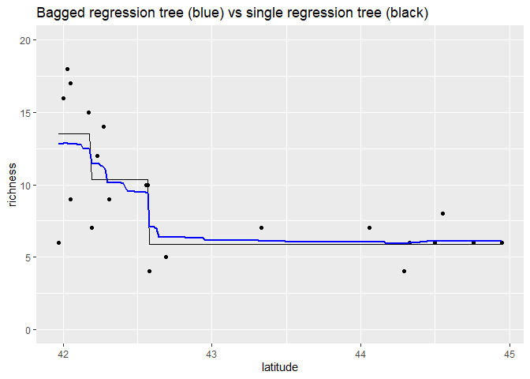
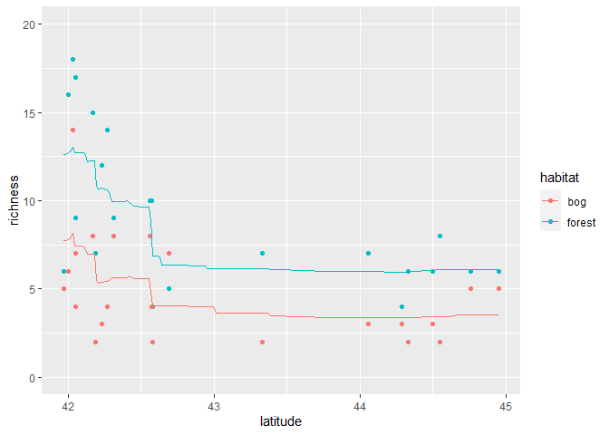

Ant data: bagging
================
Brett Melbourne
2 Dec 2022

Bagging illustrated with the ants data.

``` r
library(ggplot2)
library(dplyr)
library(tree)
```

Forest ant data:

``` r
forest_ants <- read.csv("data/ants.csv") %>% 
    filter(habitat=="forest") %>% 
    select(latitude, richness)
```

First fit a standard decision tree model for comparison. We’ll visualize
the prediction on a grid that spans the latitudes.

``` r
fit <- tree(richness ~ latitude, data=forest_ants)
grid_data <- data.frame(latitude=seq(min(forest_ants$latitude), 
                                     max(forest_ants$latitude), 
                                     length.out=201))
preds1tree <- cbind(grid_data, richness=predict(fit, newdata=grid_data))
forest_ants %>%
    ggplot(aes(x=latitude, y=richness)) +
    geom_point() +
    geom_line(data=preds1tree) +
    coord_cartesian(ylim=c(0,20))
```

<!-- -->

The plot above shows that a regression tree can be a rather crude model
and in general predictive performance is not as good as other
approaches. One way to potentially improve the predictive performance of
any base model is bootstrap aggregation, aka **bagging**, an ensemble
prediction method.

**The bagging algorithm:**

    for many repetitions
        resample the data with replacement
        train the base model
        record prediction
    final prediction = mean of predictions

Code this algorithm in R with the above decision tree as the base
model/training algorithm. We’ll predict for the grid of latitudes in
`grid_data` that we made above.

``` r
# Bagging algorithm
boot_reps <- 500
n <- nrow(forest_ants)
nn <- nrow(grid_data)
boot_preds <- matrix(rep(NA, nn*boot_reps), nrow=nn, ncol=boot_reps)
for ( i in 1:boot_reps ) {
#   resample the data (rows) with replacement
    boot_indices <- sample(1:n, n, replace=TRUE)
    boot_data <- forest_ants[boot_indices,]
#   train the base model
    boot_fit <- tree(richness ~ latitude, data=boot_data)
#   record prediction
    boot_preds[,i] <- predict(boot_fit, newdata=grid_data)
}
bagged_preds <- rowMeans(boot_preds)
```

Plot in comparison to the single tree predictions

``` r
preds <- cbind(grid_data, richness=bagged_preds)
forest_ants %>% 
    ggplot(aes(x=latitude, y=richness)) +
    geom_point() +
    geom_line(data=preds1tree) +
    geom_line(data=preds, col="blue", linewidth=1) +
    coord_cartesian(ylim=c(0,20)) +
    labs(title="Bagged regression tree (blue) vs single regression tree (black)")
```

<!-- -->

We see that the predictions from the bagged regression tree model are
smoother than for the single tree.

Package the bagging algorithm in a function

``` r
# Bagged regression tree function
# formula:    model formula (formula)
# data:       y and x data (data.frame, mixed)
# xnew_data:  x data to predict from (data.frame, mixed)
# boot_reps:  number of bootstrap replications (scalar, integer)
# return:     bagged predictions (vector, numeric)
# 
bagrt <- function(formula, data, xnew_data, boot_reps=500) {
    n <- nrow(data)
    nn <- nrow(xnew_data)
    boot_preds <- matrix(rep(NA, nn*boot_reps), nrow=nn, ncol=boot_reps)
    for ( i in 1:boot_reps ) {
    #   resample the data (rows) with replacement
        boot_indices <- sample(1:n, n, replace=TRUE)
        boot_data <- data[boot_indices,]
    #   train the base model
        boot_fit <- tree(formula, data=boot_data)
    #   record prediction
        boot_preds[,i] <- predict(boot_fit, newdata=xnew_data)
    }
    bagged_preds <- rowMeans(boot_preds)
    return(bagged_preds)
}
```

There is one tuning parameter in the bagging algorithm: boot_reps; the
number of bootstrap replications. Increasing boot_reps will decrease the
prediction variance and usually the out-of-sample prediction error; the
more bootstrap replications the better. However, there are diminishing
returns and the computational cost increases. Because of the bootstrap
samples, the `bagrt()` algorithm is stochastic: the final prediction
will be different each time we run `bagrt()` (unless we set a seed).
This stochasticity causes prediction variance, which is defined as the
variance in the bagged prediction over repeated runs of the algorithm on
the same data. The prediction variance contributes to the prediction
error, so reducing it by bagging is a good thing.

The following experiment of 20 runs on the same data of the `bagrt()`
algorithm for different values of boot_reps shows how the prediction
variance is reduced with increasing boot_reps.

``` r
runs <- 20
boot_reps <- rep(c(1, 10, 50, 100, 500, 1000), each=runs)
id <- rep(1:runs, 6) #unique labels for each run
preds <- list()
for ( i in 1:length(boot_reps) ) {
    bag_pred <- bagrt(richness ~ latitude, 
                      data=forest_ants, 
                      xnew_data=grid_data,
                      boot_reps=boot_reps[i])
    preds[[i]] <- cbind(grid_data, richness=bag_pred, boot_reps=boot_reps[i], id=id[i])
}

preds %>% 
    bind_rows() %>%  #collapses the list of data frames to a single data frame
    ggplot() +
    geom_point(data=forest_ants, aes(x=latitude, y=richness)) +
    geom_line(aes(x=latitude, y=richness, col=factor(id))) +
    facet_wrap(vars(boot_reps), labeller=label_both) +
    coord_cartesian(ylim=c(0,20)) +
    labs(title="Each panel shows 20 realizations of bagrt()") +
    theme(legend.position="none")
```

<!-- -->

We see clearly that as the number of bootstrap replications is
increased, the variance of the prediction goes down. With 1000 bootstrap
replications the 20 realizations are almost all the same, and 500
bootstrap replications is nearly as good as 1000 at reducing the
variance.

Bagged decision trees extend easily to multiple predictors of mixed type
(numeric, categorical).

``` r
# Ant data with multiple predictors

ants <- read.csv("data/ants.csv") %>% 
    select(-site) %>% 
    mutate_if(is.character, factor)

# Train a bagged tree with latitude (numeric) and habitat (categorical) as predictors
grid_data  <- expand.grid(
    latitude=seq(min(ants$latitude), max(ants$latitude), length.out=201),
    habitat=factor(c("forest","bog")))
bag_pred <- bagrt(richness ~ latitude + habitat, data=ants, xnew_data=grid_data)
preds <- cbind(grid_data, richness=bag_pred)
ants %>% 
    ggplot(aes(x=latitude, y=richness, col=habitat)) +
    geom_point() +
    geom_line(data=preds) +
    coord_cartesian(ylim=c(0,20))
```

<!-- -->
