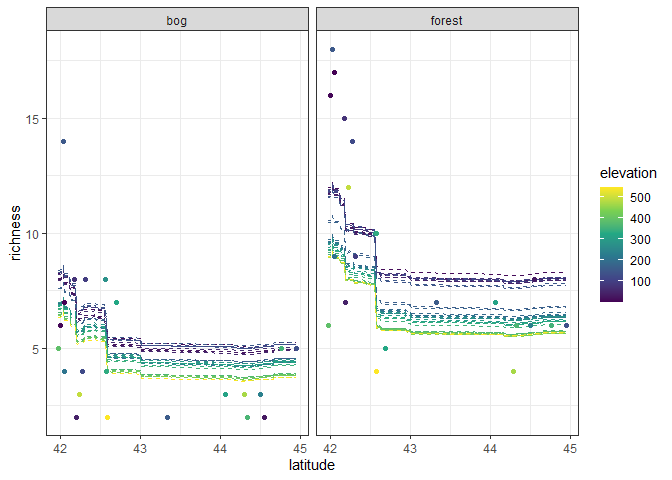
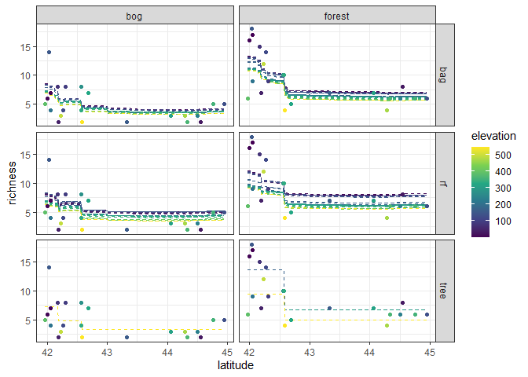

Ant data: random forest
================
Brett Melbourne
7 Feb 2022

Random forest illustrated with the ants data.

``` r
library(ggplot2)
library(dplyr)
library(tidyr)
library(tree)
library(randomForest)
source("source/bagrt.R")
```

Ant data with 3 predictors of species richness

``` r
ants <- read.csv("data/ants.csv") %>% 
    select(richness, latitude, habitat, elevation) %>% 
    mutate(habitat=factor(habitat))
```

**Random forest** is an ensemble prediction method that extends the
bagging algorithm by randomly selecting a subset of predictor variables
at each iteration. That is, random forests combines two strategies for
enhancing generalization: resampling the data (rows) and resampling the
predictors (columns).

The random forest algorithm:

    for many repetitions
        randomly select m predictor variables
        resample the data (rows) with replacement
        train the tree model
        record prediction
    final prediction = mean of predictions

Code this algorithm in R

Since this code is a proof of concept, to keep the algorithm clear and
uncluttered by book-keeping, we’ll require that the dataset be given
with the response variable (`richness`) in the first column and the full
set of predictors in the other columns. We did that when reading in the
data above.

``` r
# Random forest algorithm

# Grid of new predictor values on which to form predictions
grid_data  <- expand.grid(
    latitude=seq(min(ants$latitude), max(ants$latitude), length.out=201),
    habitat=factor(c("forest","bog")),
    elevation=seq(min(ants$elevation), max(ants$elevation), length.out=51))

# Parameters
m <- 2 #Number of predictors to sample at each iteration
boot_reps <- 500

# Setup
n <- nrow(ants)
c <- ncol(ants)
nn <- nrow(grid_data)
boot_preds <- matrix(rep(NA, nn*boot_reps), nrow=nn, ncol=boot_reps)

# Main algorithm
for ( i in 1:boot_reps ) {
#   randomly select m predictor variables
    predictor_indices <- sample(2:c, m)
    boot_data <- ants[,c(1,predictor_indices)]
#   resample the data (rows) with replacement
    boot_indices <- sample(1:n, n, replace=TRUE)
    boot_data <- boot_data[boot_indices,]
#   train the tree model
    boot_fit <- tree(richness ~ ., data=boot_data)
#   record prediction
    boot_preds[,i] <- predict(boot_fit, newdata=grid_data)
}
rf_preds <- rowMeans(boot_preds)
```

Plot predictions with elevation mapped to the viridis color scale

``` r
preds <- cbind(grid_data, richness=rf_preds)
ants %>% 
    ggplot() +
    geom_line(data=preds, 
              aes(x=latitude, y=richness, col=elevation, group=factor(elevation)),
              linetype=2) +
    geom_point(aes(x=latitude, y=richness, col=elevation)) +
    facet_wrap(vars(habitat)) +
    scale_color_viridis_c() +
    theme_bw()
```

<!-- -->

Before moving on, we’ll make the algorithm into a function. We’re not
especially concerned with performance or elegance. One small performance
boost we can easily make is reduce two copy operations to one by
extracting columns and rows at the same time. On the other hand, while
we could automatically extract the name of the response variable and
build a model formula we’ll leave it up to the user to provide a correct
formula and dataset (it’s only for our use and documented in the
function). This will also be consistent with our previous functions.

``` r
# Random forest function
# formula:    model formula to indicate response variable (formula)
#             must be: y ~ ., where y is the name of the variable
# data:       y and x data (data.frame, mixed)
#             y must be first column; all other columns will be used for x
# xnew_data:  x data to predict from (data.frame, mixed)
# m:          number of predictors to sample (scalar, integer)
# boot_reps:  number of bootstrap replications (scalar, integer)
# return:     bagged predictions (vector, numeric)
# 
random_forest <- function(formula, data, xnew_data, m, boot_reps=500) {
    # Setup
    n <- nrow(data)
    c <- ncol(data)
    nn <- nrow(xnew_data)
    boot_preds <- matrix(rep(NA, nn*boot_reps), nrow=nn, ncol=boot_reps)
    
    # Main algorithm
    for ( i in 1:boot_reps ) {
    #   randomly select m predictor variables
        predictor_indices <- sample(2:c, m)
    #   resample the data (rows) with replacement
        boot_indices <- sample(1:n, n, replace=TRUE)
    #   form the boot dataset
        boot_data <- data[boot_indices, c(1,predictor_indices)]
    #   train the tree model
        boot_fit <- tree(formula, data=boot_data)
    #   record prediction
        boot_preds[,i] <- predict(boot_fit, newdata=xnew_data)
    }
    rf_preds <- rowMeans(boot_preds)
    return(rf_preds)
}
```

Now use the function. The notation `~ .` means use all the predictor
variables in the data frame.

``` r
preds_rf <- random_forest(richness ~ ., data=ants, xnew_data=grid_data, m=2)
```

Train a bagged tree and a single decision tree for comparison

``` r
preds_bag <- bagrt(richness ~ ., data=ants, xnew_data=grid_data)
preds_tree <- predict(tree(richness ~ ., data=ants), newdata=grid_data)
```

Plot together

``` r
cbind(grid_data, preds_rf, preds_bag, preds_tree) %>% 
    pivot_longer(cols=starts_with("preds_"), 
                 names_to="model",
                 names_prefix="preds_",
                 values_to="richness") %>%
    ggplot() +
    geom_line(aes(x=latitude, y=richness, col=elevation, group=factor(elevation)),
              linetype=2) +
    geom_point(data=ants, aes(x=latitude, y=richness, col=elevation)) +
    facet_grid(rows=vars(model), cols=vars(habitat)) +
    scale_color_viridis_c() +
    theme_bw()
```

<!-- -->

Using `randomForest()` from the randomForest package. Compared with our
proof of concept code, the difference is due to the implementation and
default settings of the base tree algorithm.

``` r
rf_pkg_train <- randomForest(richness ~ ., data=ants, ntree=500, mtry=2)
preds_rf_pkg <- predict(rf_pkg_train, newdata=grid_data)

cbind(grid_data, preds_rf, preds_rf_pkg) %>% 
    pivot_longer(cols=starts_with("preds_"), 
                 names_to="model",
                 names_prefix="preds_",
                 values_to="richness") %>%
    ggplot() +
    geom_line(aes(x=latitude, y=richness, col=elevation, group=factor(elevation)),
              linetype=2) +
    geom_point(data=ants, aes(x=latitude, y=richness, col=elevation)) +
    facet_grid(rows=vars(model), cols=vars(habitat)) +
    scale_color_viridis_c() +
    labs(title="Top row: proof of concept code. Bottom row: randomForest package") +
    theme_bw()
```

<!-- -->

Tuning the random forest algorithm. We can use out-of-bag error for
number of trees. We don’t get much improvement in prediction skill
beyond about 100 trees and by 350 trees the prediction skill is very
stable.

``` r
# Visualize OOB error for number of trees
plot(rf_pkg_train)
```

<!-- -->

We could tune number of trees, mtry, and the minimum node size of trees
(a tree stopping rule).

One nice aspect of random forest is the ability to consider variable
importance, a measure of how much each variable contributes to
predictive skill. Here we see that latitude is the most important
predictor.

``` r
importance(rf_pkg_train)
```

    ##           IncNodePurity
    ## latitude       307.6194
    ## habitat        173.0968
    ## elevation      192.0427

``` r
varImpPlot(rf_pkg_train)
```

<!-- -->
