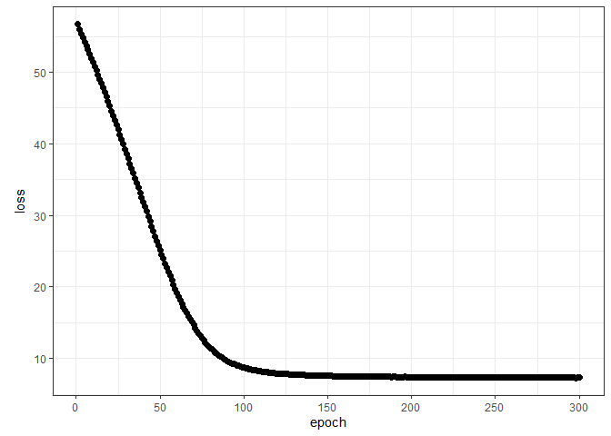
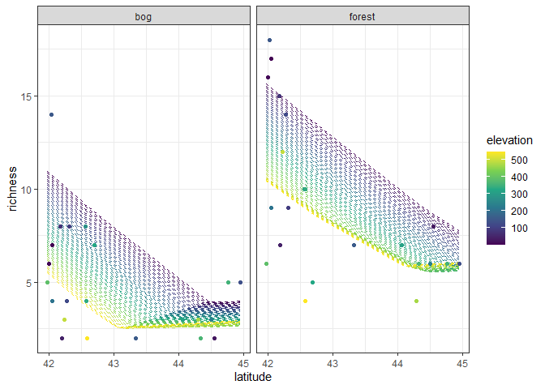

Ant data: neural network
================
Brett Melbourne
2 Dec 2022

A single layer neural network, or feedforward network, illustrated with
the ants data and the `keras` package. You’ll need to install Python and
Tensorflow to use the `keras` package. The `keras` package is an R
interface to the Python Keras library, which in turn is an interface to
the Python Tensorflow library, which in turn is an interface to
Tensorflow (mostly C++)! See 05_keras_installation.md. The Python Keras
library is widely used and the R functions and workflow closely mirror
the Python functions and workflow, so what we’ll learn in Keras for R
largely applies to Keras for Python as well.

``` r
library(ggplot2)
library(dplyr)
library(keras)
```

Ant data with 3 predictors of species richness

``` r
ants <- read.csv("data/ants.csv") %>% 
    select(richness, latitude, habitat, elevation) %>% 
    mutate(habitat=factor(habitat))
```

First we’ll set a random seed for reproducibility. The seed applies to
R, Python, and Tensorflow. It will take a few moments for Tensorflow to
get set up and there may be some warnings (CUDA/GPU, seed) but these
warnings are safe to ignore.

``` r
tensorflow::set_random_seed(5574)
```

    ## Loaded Tensorflow version 2.5.0

Next, prepare the data:

``` r
xtrain <- ants[,-1] %>% 
    mutate(across(where(is.numeric), scale)) %>% 
    model.matrix(~ . -1, .)

ytrain <- ants[,1]
```

Next, specify the model. The basic syntax builds the model layer by
layer, using the pipe operator to express the flow of information from
the output of one layer to the input of the next. Here,
`keras_model_sequential()` says we will build a sequential (or
feedforward) network and the input layer will have `ncol(xtrain)` units
(i.e. there will be one input unit, or node, for each of the 4 predictor
columns in our ant data). The next layer, a hidden layer, will be a
densely-connected layer (i.e. all units from the previous layer
connected to all units of the hidden layer) with 5 units, and it will be
passed through the ReLU activation function. The output layer will be
another densely-connected layer with 1 unit and no activation applied.

``` r
modnn1 <- keras_model_sequential(input_shape = ncol(xtrain)) %>%
    layer_dense(units = 5) %>%
    layer_activation("relu") %>% 
    layer_dense(units = 1)
```

Again, there will likely be some warnings and messages but they are safe
to ignore.

We can check the configuration:

``` r
modnn1
```

    ## Model: "sequential"
    ## ________________________________________________________________________________
    ## Layer (type)                        Output Shape                    Param #     
    ## ================================================================================
    ## dense_1 (Dense)                     (None, 5)                       25          
    ## ________________________________________________________________________________
    ## activation (Activation)             (None, 5)                       0           
    ## ________________________________________________________________________________
    ## dense (Dense)                       (None, 1)                       6           
    ## ================================================================================
    ## Total params: 31
    ## Trainable params: 31
    ## Non-trainable params: 0
    ## ________________________________________________________________________________

The model and layer names, such as “sequential_1” and “dense_2” are
names given to the objects created in the tensorflow workspace for this
R session. We see that layer 1 has 25 parameters as we expect (5x4
weights and 5 biases) and the output layer has 6 parameters as we expect
(5 weights and 1 bias). This model thus has a total of 31 parameters.

Next, compile the model. We are specifying that the optimizer algorithm
is RMSprop and the loss function is mean squared error. Notice that we
are not modifying the R `modnn1` object but are instead directing Keras
in Python to set up for training the model.

``` r
compile(modnn1, optimizer="rmsprop", loss="mse")
```

The RMSprop algorithm is the default in Keras and works for most models.
It implements stochastic gradient descent with various performance
enhancements. By default, the learning rate parameter has a learning
rate of 0.001 but this can be tuned (see `?optimizer_rmsprop`). Other
optimizers are available.

Now train the model, keeping a copy of the training history. Again, we
are not getting a new R fitted-model object out of this as we would in
say a call to `fit()` with an `lm` object but instead we are directing
Keras in Python to train the model. The history object is a by-product
of training, so I put it on the right-hand side of the expression to be
clear that this is a by-product and not a traditional R fitted-model
object. In one epoch, the training data are sampled in batches (one SGD
step is taken for each batch) until all of the data have been sampled,
so the number of epochs is essentially the number of complete iterations
through the training data. I chose 300 epochs because the fit improves
only slowly beyond that. Here I used a batch size of 4, which means 10%
of the data are used on each subsample to calculate the stochastic
gradient descent step. Training will take a minute or so and a plot will
chart its progress.

``` r
fit(modnn1, xtrain, ytrain, epochs = 300, batch_size=4) -> history
```

As it takes time to train these models, it’s worth saving the model and
history so they they can be reloaded later. We can also load this saved
model in Python or share with colleagues. The help for `load_model_hdf5`
says the model will be compiled on load but that doesn’t always seem to
work (e.g. new R session, knitting). Recompile if needed.

``` r
# save_model_hdf5(modnn1, "05_ants_neural_net_files/saved/modnn1.hdf5")
# save(history, file="05_ants_neural_net_files/saved/modnn1_history.Rdata")
modnn1 <- load_model_hdf5("05_ants_neural_net_files/saved/modnn1.hdf5")
load("05_ants_neural_net_files/saved/modnn1_history.Rdata")
```

We can plot the history once training is done. If you have `ggplot2`
loaded, it will create a ggplot, otherwise it will create a base plot.

``` r
plot(history, smooth=FALSE, theme_bw=TRUE)
```

<!-- -->

We want to see the training error (MSE, labelled “loss” above) decline
to a reasonable level. Although the error will continue to go down, here
we see it leveling out somewhat at about MSE=7, which is an absolute
error of sqrt(7) = +/- 2.6 species.

Make predictions for a grid of new predictor variables `x`.

``` r
grid_data  <- expand.grid(
    latitude=seq(min(ants$latitude), max(ants$latitude), length.out=201),
    habitat=factor(c("forest","bog")),
    elevation=seq(min(ants$elevation), max(ants$elevation), length.out=51))

# data preparation: scale, dummy encoding, convert to matrix
x <- grid_data %>% 
    mutate(across(where(is.numeric), scale)) %>% 
    model.matrix(~ . -1, .)

# Predictions
npred <- predict(modnn1, x)
preds <- cbind(grid_data, richness=npred)
```

Plot the fitted model with the data

``` r
ants %>% 
    ggplot() +
    geom_line(data=preds, 
              aes(x=latitude, y=richness, col=elevation, group=factor(elevation)),
              linetype=2) +
    geom_point(aes(x=latitude, y=richness, col=elevation)) +
    facet_wrap(vars(habitat)) +
    scale_color_viridis_c() +
    theme_bw()
```

<!-- -->
